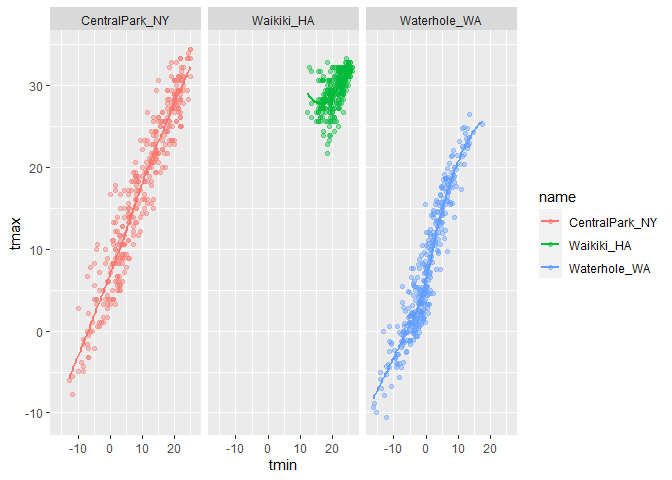
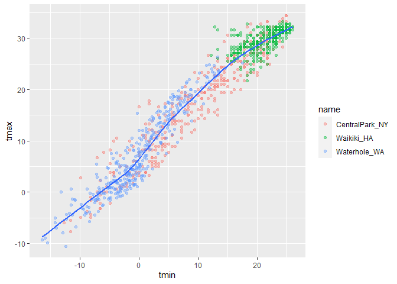

ggplot 1
================

``` r
library(tidyverse)
```

    ## -- Attaching packages --------------------------------------- tidyverse 1.3.1 --

    ## v ggplot2 3.3.5     v purrr   0.3.4
    ## v tibble  3.1.4     v dplyr   1.0.7
    ## v tidyr   1.1.3     v stringr 1.4.0
    ## v readr   2.0.1     v forcats 0.5.1

    ## -- Conflicts ------------------------------------------ tidyverse_conflicts() --
    ## x dplyr::filter() masks stats::filter()
    ## x dplyr::lag()    masks stats::lag()

Load in a dataset

``` r
weather_df = 
  rnoaa::meteo_pull_monitors(
    c("USW00094728", "USC00519397", "USS0023B17S"),
    var = c("PRCP", "TMIN", "TMAX"), 
    date_min = "2017-01-01",
    date_max = "2017-12-31") %>%
  mutate(
    name = recode(
      id, 
      USW00094728 = "CentralPark_NY", 
      USC00519397 = "Waikiki_HA",
      USS0023B17S = "Waterhole_WA"),
    tmin = tmin / 10,
    tmax = tmax / 10) %>%
  select(name, id, everything())
```

    ## Registered S3 method overwritten by 'hoardr':
    ##   method           from
    ##   print.cache_info httr

    ## using cached file: C:\Users\JENNIF~2\AppData\Local/Cache/R/noaa_ghcnd/USW00094728.dly

    ## date created (size, mb): 2021-10-20 17:39:11 (7.621)

    ## file min/max dates: 1869-01-01 / 2021-10-31

    ## using cached file: C:\Users\JENNIF~2\AppData\Local/Cache/R/noaa_ghcnd/USC00519397.dly

    ## date created (size, mb): 2021-10-20 17:39:30 (1.701)

    ## file min/max dates: 1965-01-01 / 2020-02-29

    ## using cached file: C:\Users\JENNIF~2\AppData\Local/Cache/R/noaa_ghcnd/USS0023B17S.dly

    ## date created (size, mb): 2021-10-20 17:39:40 (0.914)

    ## file min/max dates: 1999-09-01 / 2021-10-31

## Scatterplot

``` r
weather_df %>% 
  ggplot(aes(x = tmin, y = tmax)) +
  geom_point()
```

    ## Warning: Removed 15 rows containing missing values (geom_point).

<!-- -->

you can save ggplots

``` r
ggp_tmax_tmin =
  weather_df %>% 
  ggplot(aes(x = tmin, y = tmax)) +
  geom_point()
```

## let’s fancy it up

e.g. color, lines, other stuff

``` r
  weather_df %>% 
  ggplot(aes(x = tmin, y = tmax, color = name)) +
  geom_point(alpha = .4) + 
  geom_smooth(se = FALSE) + 
  facet_grid(. ~name)
```

    ## `geom_smooth()` using method = 'loess' and formula 'y ~ x'

    ## Warning: Removed 15 rows containing non-finite values (stat_smooth).

    ## Warning: Removed 15 rows containing missing values (geom_point).

<!-- -->

``` r
## using name creates a legend too
## geom_smooth creates a line for each name 
## you can use geom_point alpha and alpha = 1 points are solid and 0 is clear
## if you want to have the data gsmooth and geom point spread out more use facet grid
## Facet grid allows you to define multiple plots with x and y defined. name would tell them that you don't want to separate out the rows.
## to turn off color say color = NULL 
```

    ## `geom_smooth()` using method = 'gam' and formula 'y ~ s(x, bs = "cs")'

    ## Warning: Removed 15 rows containing non-finite values (stat_smooth).

    ## Warning: Removed 15 rows containing missing values (geom_point).

<!-- -->
